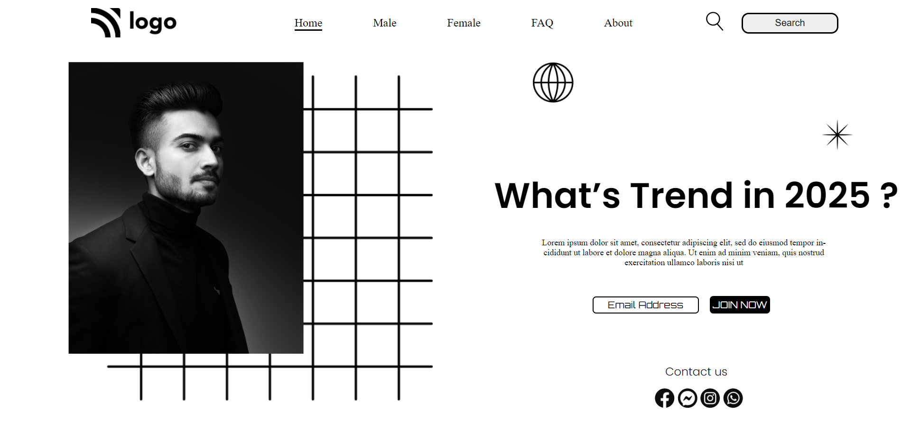

# Assignment 1

---

## Project 1 [Live Link](https://62e44763fa5d2600c293d563--zippy-toffee-9765e7.netlify.app/)

-   Skills Gained in this project
    -   Learnd to use css position [Relative & Absolute] property.
    -   Learned to use pseudo classes like **:nth-child()**, **:not()**, **:last-child**, **first-child**
    -   Learned to create underline on navbar link using **::after** & **::before** pseudo elements.

    ---

## Time taken to finish this project

-   3 hours to complete it.

#### Screenshot

