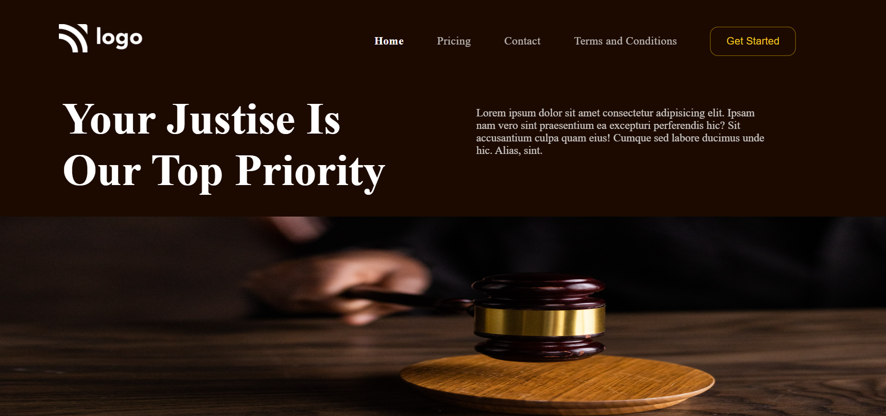

# Assignment 3

---

## Project 3 [Live Link](https://bucolic-rugelach-d2ed97.netlify.app/)

-   Skills Gained in this project
    -   Learnd CSS FLEX AND FLEX PROPERTIES.
    -   Used width in Properties

    ---

## Time taken to finish this project

-   2 hours to complete it.

#### Screenshot

