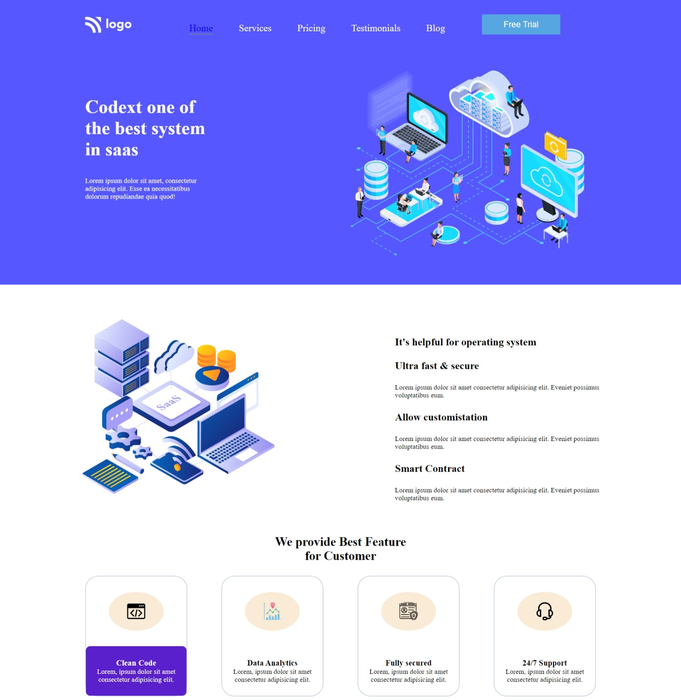

# Assignment 13

---

## Project 13 [Live Link](https://timely-raindrop-98618f.netlify.app/)

-   Skills Gained in this project
    -   FLEXBOX (FLEX- GAP with width in %) 

    ---

## Time taken to finish this project

-   7 hours to complete it.

#### Screenshot

