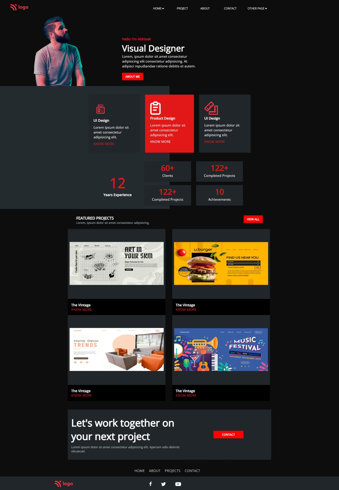

# Assignment 15

---

## Project 15 [Live Link](https://beamish-bienenstitch-adb73f.netlify.app/)

-   Skills Gained in this project
    -  grid,flex and how to use both
    - flex is 1 dimensional and grid is dimensional.Try to break problem in smaller problems and how to approach it

    ---

## Time taken to finish this project

-   5 hours to complete it.

#### Screenshot

